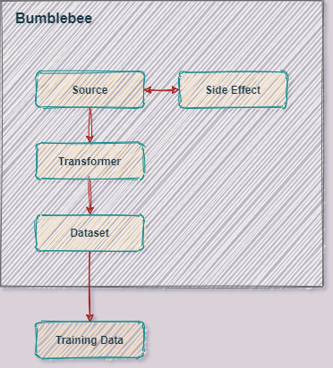

# Bumblebee


## Install

```
pip install eyecu_bumblebee
```

## Our Website

[EyeCU Vision](https://eyecuvision.com/) \
[EyeCU Future](https://eyecufuture.com/) 


## Example

```python
from bumblebee import *

if __name__ == "__main__":
    
    VIDEO_PATH = "/path/to/video.mp4"

    # Create a source
    file_stream = sources.FileStream(VIDEO_PATH)

    # Add an effect
    goto = effects.GoTo(file_stream)

    # Add some transformers
    data = transformers.GrayScale(file_stream)
    data = transformers.Normalization(data)

    END_OF_VIDEO = file_stream.get_duration()
    goto(END_OF_VIDEO)

    # Create a dataset
    single_frame = datasets.SingleFrame(data)

    last_frame = single_frame.read()

```

## Architecture Diagram



